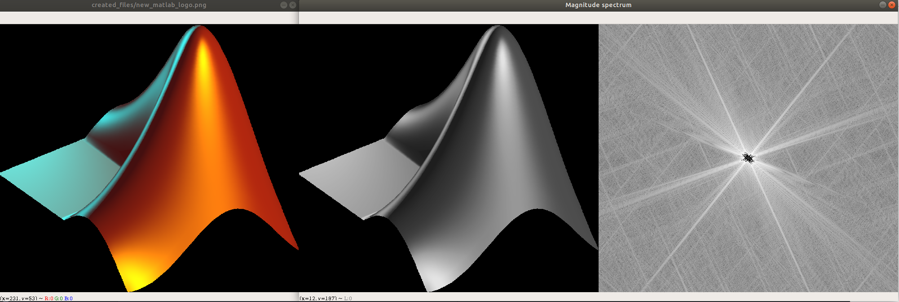
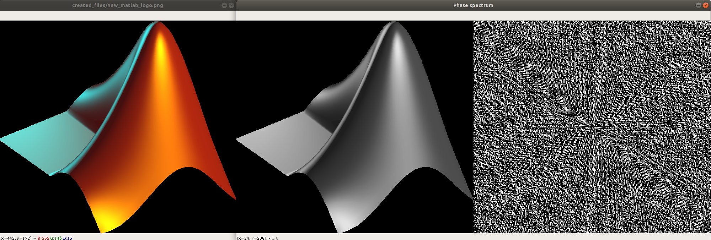
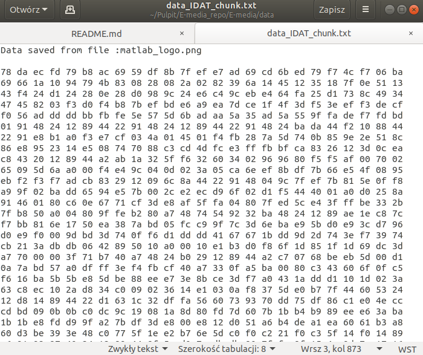

# E-media ( academic year : 2019/20 )

A file format chosen : PNG

# First example 
# An example program output (1) :

File name : matlab_logo.png
New file name : new_matlab_logo.png
Signature ok

1. IHDR found

/######################
/# Reading IHDR chunk #
/######################

Width : 667
Height : 599
Bit depth : 8
Colour type : TRUECOLOUR_WITH_ALPHA
Compression method : DEFLATE_INFLATE
Filter method : NONE
Interlace method : NULL

2. PLTE not found

3. IDAT found

/######################
/# Reading IDAT chunk #
/######################

File name : matlab_logo.png
New file name : new_matlab_logo.png
Signature ok

1. IHDR found

/######################
/# Reading IHDR chunk #
/######################

Width : 667
Height : 599
Bit depth : 8
Colour type : TRUECOLOUR_WITH_ALPHA
Compression method : DEFLATE_INFLATE
Filter method : NONE
Interlace method : NULL

2. PLTE not found

3. IDAT found

/######################
/# Reading IDAT chunk #
/######################

Output saved in a .txt file in /data directory

4. IEND found

/######################
/# Reading IEND chunk #
/######################

Chunk lenght : 0

5. tIME found

/######################
/# Reading tIME chunk #
/######################

 Year : 2017
 Month : 3
 Day : 7
 Hour : 4
 Minute : 11
 Second : 56

6. gAMA found

/######################
/# Reading gAMA chunk #
/######################

Image gamma : 45455

7. tEXtfound

/######################
/# Reading tEXt chunk #
/######################

tEXt Content: 
 commentFile source: https://commons.wikimedia.org/wiki/File:Matlab_Logo.png

/######################
/# Removing chunks    #
/######################

Deleted 10 chunks with signature: 74455874

Deleted 0 chunks with signature: 7A545874

Deleted 1 chunks with signature: 74494d45

Deleted 1 chunks with signature: 67414d41

/##########################
/# Anonimization check    #
/##########################

5. tIME not found

6. gAMA not found

7. tEXt not found

Output saved in a .txt file in /data directory

4. IEND found

/######################
/# Reading IEND chunk #
/######################

Chunk lenght : 0

5. tIME found

/######################
/# Reading tIME chunk #
/######################

 Year : 2017
 Month : 3
 Day : 7
 Hour : 4
 Minute : 11
 Second : 56

6. gAMA found

/######################
/# Reading gAMA chunk #
/######################

Image gamma : 45455

7. tEXtfound

/######################
/# Reading tEXt chunk #
/######################

tEXt Content: 
 commentFile source: https://commons.wikimedia.org/wiki/File:Matlab_Logo.png

/######################
/# Removing chunks    #
/######################

Deleted 10 chunks with signature: 74455874

Deleted 0 chunks with signature: 7A545874

Deleted 1 chunks with signature: 74494d45

Deleted 1 chunks with signature: 67414d41

/##########################
/# Anonimization check    #
/##########################

5. tIME not found

6. gAMA not found

7. tEXt not found

# Plots for example (1) :

 
[fig:mylabel]

 
[fig:mylabel]

 
[fig:mylabel]

