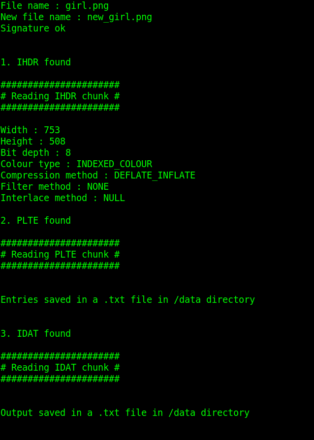
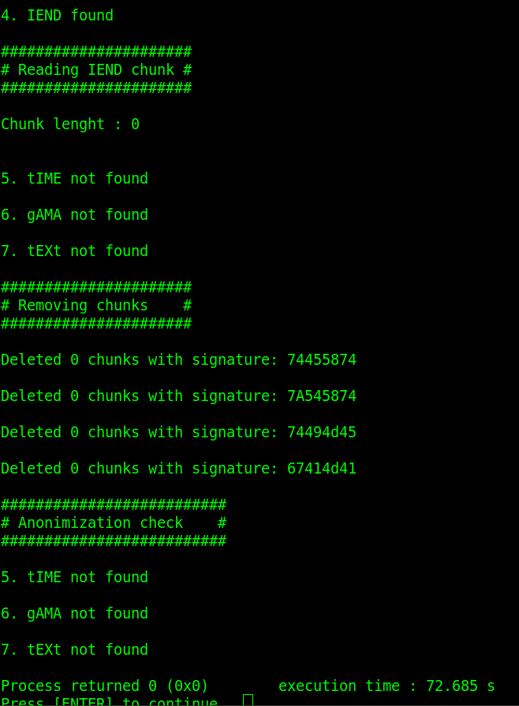
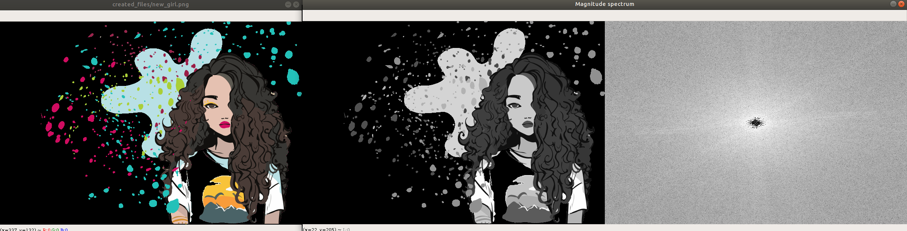
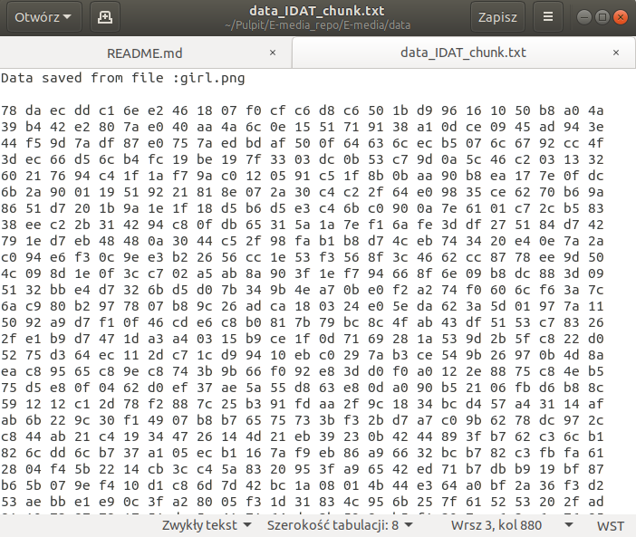
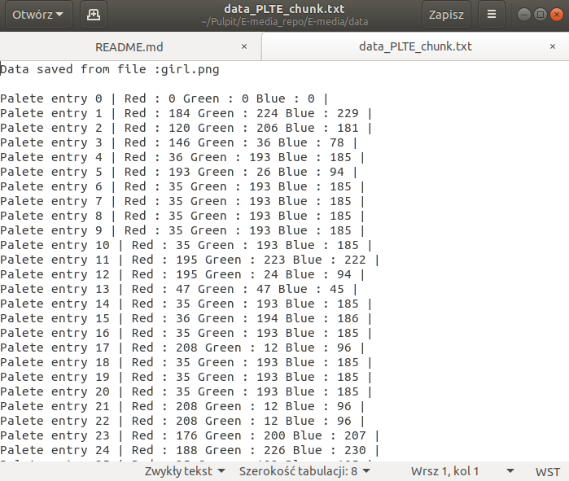
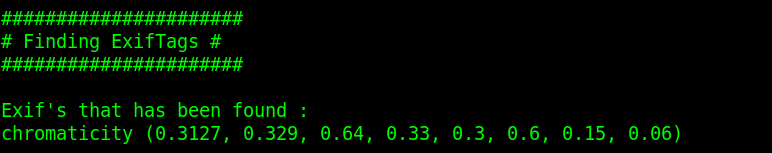

# E-media ( academic year : 2019/20 ) 
  
Repo for first part of the project.   
A file format chosen : PNG

# First example 
# Program output for first example  :

# Plots for first example  :

# Data for first example :

# Second example 
# Program output for second example  :

# Plots for second example  :

# Data for second example :

# Added finding exif's from PIL and PIL.ExifTags library 

