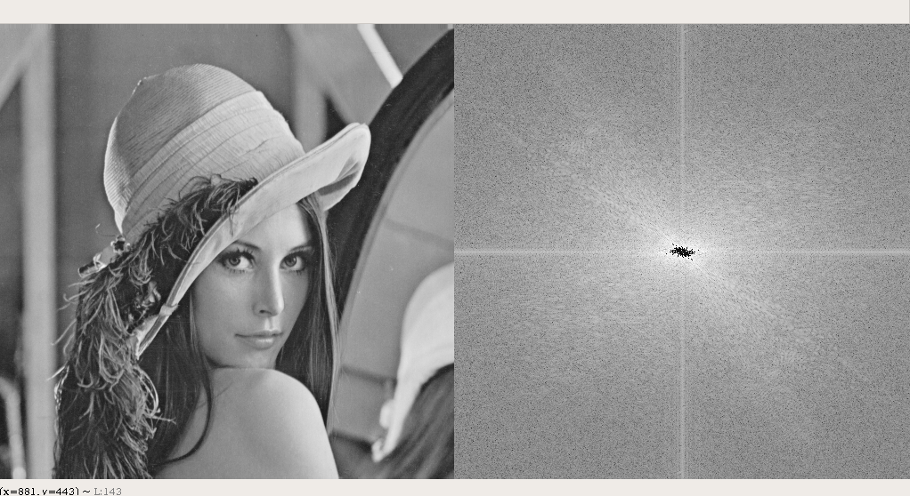
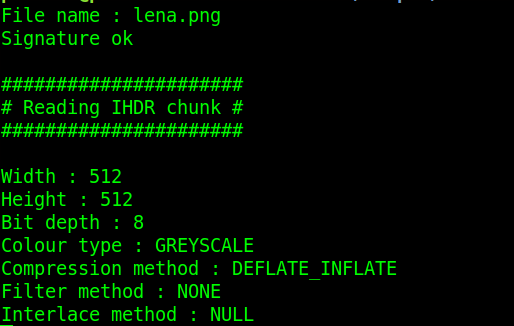
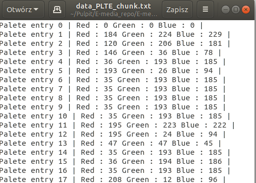
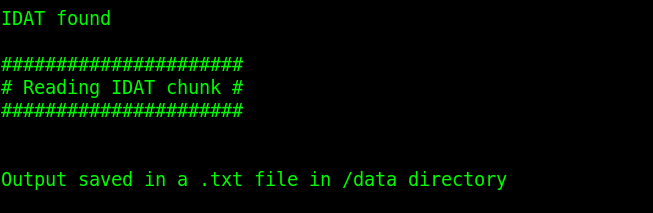
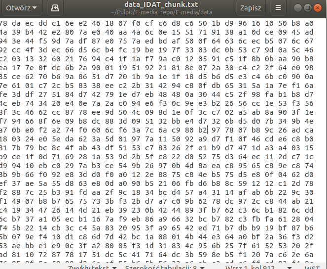

# E-media-> rok akademicki 2019/20

A file format chosen : PNG

# 1.Show image function 

 
[fig:my~l~abel]

# 2.Fourier transform function

 
[fig:my~l~abel]

# 3.IHDR analizing function

 
[fig:my~l~abel]

# 4.PLTE analizing function

[fig:my~l~abel]

[fig:my~l~abel]

# 5.IDAT reading function

[fig:my~l~abel]

[fig:my~l~abel]

# 6.IEND finding function

[fig:my~l~abel]

