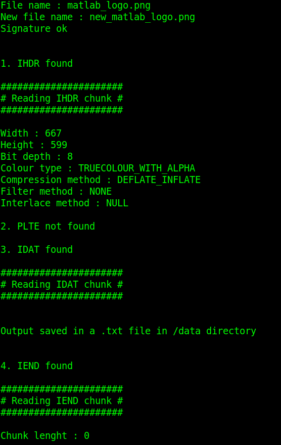
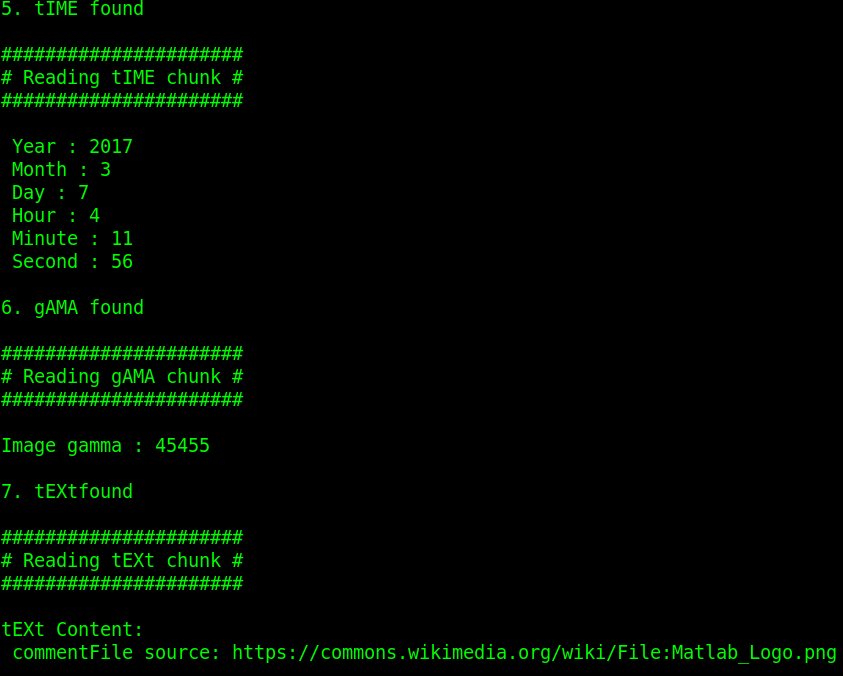
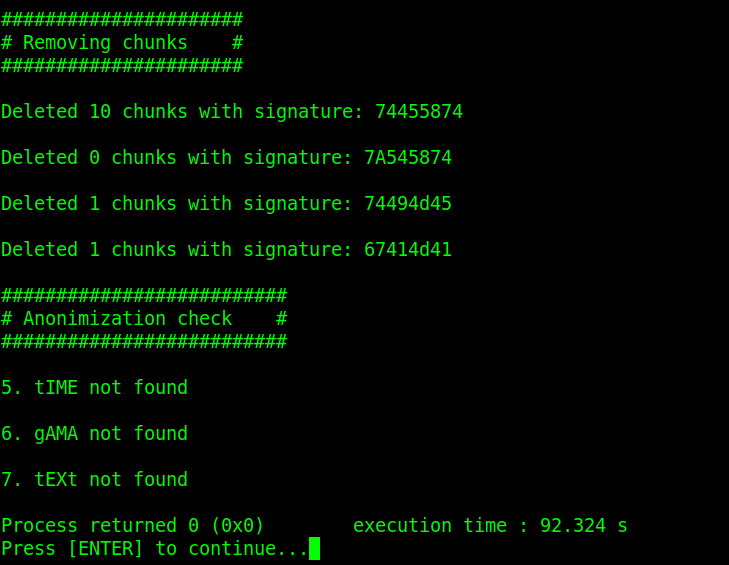

# E-media ( academic year : 2019/20 )

A file format chosen : PNG

# First example 
# Program output for first example  :

 
[fig:mylabel]
 
[fig:mylabel]
 
[fig:mylabel]

# Plots for first example  :

 
[fig:mylabel]

 
[fig:mylabel]

# Data for first example :

 
[fig:mylabel]

