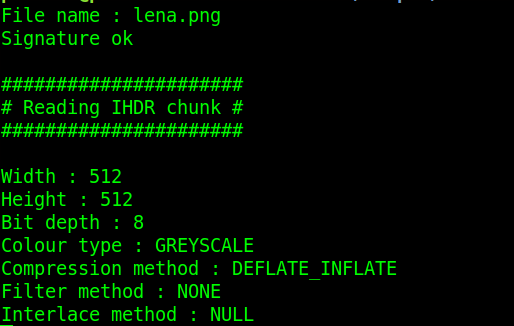

# E-media-> rok akademicki 2019/20

Wybrany format plików : PNG

# 1.Show image function 

 
[fig:my~l~abel]

# 2.Fourier transform function

 
[fig:my~l~abel]

# 3.IHDR analizing function

 
[fig:my~l~abel]
