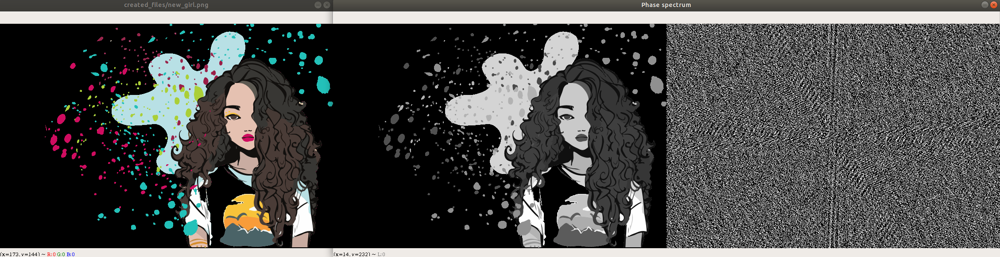

# E-media ( academic year : 2019/20 ) 
  
Repo for the first part of our  project.   
A file format chosen : PNG

# First example 
# Program output for first example  :

> File name : matlab_logo.png   
> New file name : new_logo.png         
> Signature ok  
>  
>   
>1.IHDR found  
>  
> ######################  
>\# Reading IHDR chunk  \#  
> ######################  
>  
> Width : 667  
> Height : 599  
> Bit depth : 8  
> Colour type : TRUECOLOUR_WITH_ALPHA  
> Compression method : DEFLATE_INFLATE  
> Filter method : NONE  
> Interlace method : NULL  
>   
>2.PLTE not found  
>  
>3.IDAT found  
>  
> ######################  
> \# Reading IDAT chunk  \#  
> ######################  
>   
>  
> Output saved in a .txt file in /data directory  
>  
>  
>4.IEND found  
>  
> ######################  
> \# Reading IEND chunk  \#  
> ######################  
>  
> Chunk lenght : 0   
>  
>  
>5.tIME found  
>  
> ######################  
> \#  Reading tIME chunk  \#  
> ######################  
>  
> Year : 2017  
> Month : 3  
> Day : 7  
> Hour : 4  
> Minute : 11  
> Second : 56  
>  
>6.gAMA found  
>  
> ######################  
> \# Reading gAMA chunk  \#  
> ######################  
>  
> Image gamma : 45455  
>  
>7.tEXtfound  
>  
> ######################  
> \# Reading tEXt chunk \#  
> ######################  
>  
> tEXt Content:   
> commentFile source: https://commons.wikimedia.org/wiki/File:Matlab_Logo.png  
>  
> ######################  
> \#   Removing chunks    \#  
> ######################  
>  
> Deleted 10 chunks with signature: 74455874  
>  
> Deleted 0 chunks with signature: 7A545874  
>  
> Deleted 1 chunks with signature: 74494d45  
>  
> Deleted 1 chunks with signature: 67414d41  
>  
> ##########################  
> \#   Anonimization check    \#  
> ##########################  
>    
> 5. tIME not found  
>  
> 6. gAMA not found  
>  
> 7. tEXt not found  
>  
> ######################  
> \#  Finding ExifTags  \#  
> ######################  
>  
> Exif's that has been found :  
> chromaticity (0.3127, 0.329, 0.64, 0.33, 0.3, 0.6, 0.15, 0.06)  
> dpi (96, 96)  
>  

# Plots for first example  :

# Data for first example :

# Second example 
# Program output for second example  :

> File name : girl.png  
> New file name : new_girl.png  
> Signature ok  
>  
>  
>1.IHDR found  
>  
> ######################  
> \# Reading IHDR chunk \#  
> ######################  
>  
> Width : 753  
> Height : 508  
> Bit depth : 8  
> Colour type : INDEXED_COLOUR  
> Compression method : DEFLATE_INFLATE  
> Filter method : NONE  
> Interlace method : NULL  
>   
>2.PLTE found  
>  
> ######################  
> \# Reading PLTE chunk \#  
> ######################  
>  
>  
> Entries saved in a .txt file in /data directory  
>  
>  
>3.IDAT found  
>  
> ######################  
> \# Reading IDAT chunk \#  
> ######################  
>  
>  
> Output saved in a .txt file in /data directory  
>  
>  
>4.IEND found  
>  
> ######################  
> \# Reading IEND chunk \#  
> ######################  
>  
> Chunk lenght : 0  
>  
>  
>5.tIME not found  
>  
>6.gAMA not found  
>  
>7.tEXt not found  
>  
> ######################  
> \# Removing chunks    \#  
> ######################  
>   
> Deleted 0 chunks with signature: 74455874  
>   
> Deleted 0 chunks with signature: 7A545874  
>  
> Deleted 0 chunks with signature: 74494d45  
>  
> Deleted 0 chunks with signature: 67414d41  
>  
> ##########################  
> \# Anonimization check    \#  
> ##########################  
>  
> 5. tIME not found  
>  
> 6. gAMA not found  
>  
> 7. tEXt not found  
>  
> ######################  
> \# Finding ExifTags \#  
> ######################  
>  
>Exif's that has been found :  
>transparency b'\x00n\n\r\xf4\x1b\x1c\x12)dS\x18,\x1au\xeb\xb0h\xa0C\x83?\x96vK\xbf*T\xfc\xcc5\xef\x92[\xfd\x7f\xfewg\xf0O\x8c\xf7;\xec\xa9\xbbh,   
>\xdb~~\x9a\xe2\xe3\x19\xe7\xd8\x999\xfe\xa8\xc0\xdf\xcb\xfe\xb7\xfe\xfd\xb6\x9d\x84\xab\xe1C\x99\xc0L\xd93\x82p\xea\xd1\xce\x8ey\x96\xce\xc8\xb4\xcd^\xfe\x90\xcd\x80,  
>\x96\x90\x84\xa9\xdc\xb4\xb2\xb3\x9eG\xfe\xde\xb8\xfef\xa3l.\xee\xcb\xfe\xd3Kg\xd9\xda\x86\xc1\xa5\x96\xcf\xe3\xbf\xabx\xfb\xd2\xb7\x81\xfd'  

# Plots for second example  :

# Data for second example :

